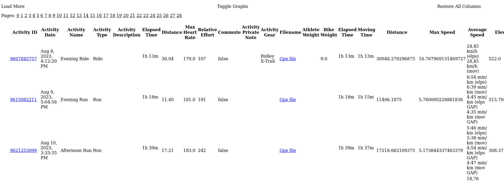
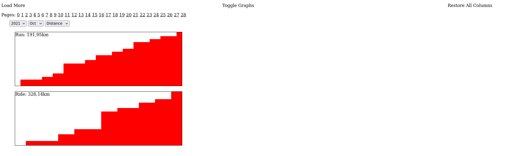

# Strava Export Visualizer

Silly self-contained webpage which can quickly visualize data that a user can download from Strava via the "Download Request" feature (available from Desktop, under the "Settings -> My account" menu).

The following screenshots demo the (very basic) functionality of the page; all it does is correctly read the `activities.csv` file included in the Strava export as a data source, and then apply a few computations and transformation on the data for visualization purposes.
What you'll find that is not raw data:

* Monthly distance/elevation/time cumulative stats, including progress graph;
* Grade Adjusted Pace computation for running activities;
* Date, Times and Distances formatting (at least in some columns);
* Media preview and link, activity source file link (provided the relative folders from the data export are available)
* You can click on columns to hide them and get a more compact visualization with only the fields you need. I could've made this selection, but chose to be unopinionated and show everything, leaving the choice to the user.

### Requirements

The code, as-is, assumes `activities.csv` file, `media` and `activities` folder to live in the same directory of the page itself. Of course, you can host these wherever you want (e.g. you may want to keep the `index.html` file locally, as the page can run even from `file:///` source, but local ajax calls are disabled by default on browsers for security reasons, so you may want to host the rest of the data on some web server you control).

It's still possible but not recommended (at least for Firefox) to configure your browser so that it will allow local ajax calls, you can Google it.

### A note on the tech stack

The page is almost dependency-free. It uses an old jQuery version. Not only jQuery, but all of the javascript included is definitely not 2025 Javascript. The project itself was not born in 2025, it's way older than that, I just decided to polish and publish it recently, as an exercise. Anyway, I'm mostly mostly not a frontend web developer, so no use in debating this. If part of this can be useful for you, you can take the parts you need and move on.

### Fake TODO

The project was a throwaway idea and thus will surely never be completed, but of course there would be a few improvement directions possible, for example:

* Decent skinning
* Sensible default column selection
* Queryability
* Weekly/yearly/... stats
* Comparisons
* Replicating some of the Strava visualizations, just for fun
* Gpx preview on a canvas (?)